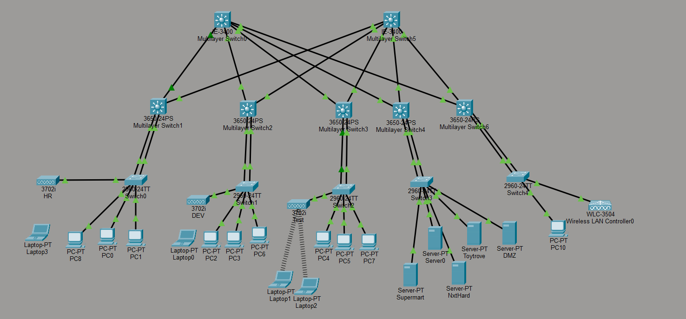

# 🌐 Enterprise Network Infrastructure with Security, Monitoring & High Availability

<div align="center">


### 🚀 Enterprise Campus Network Simulation using Cisco Packet Tracer

</div>

---

# 📖 Overview

This project demonstrates a **real-world enterprise campus network** built using Cisco Packet Tracer.

The network follows a **three-tier hierarchical architecture** consisting of:

* Core Layer
* Distribution Layer
* Access Layer

The infrastructure provides:

✅ Dynamic Routing

✅ Department Segmentation

✅ Network Security

✅ Wireless Connectivity

✅ Monitoring & Logging

✅ Enterprise Services

The project simulates how modern organizations manage secure communication between departments while maintaining scalability and availability.

---

# 🏗️ Network Architecture

```text
                    CORE LAYER
               ┌─────────────────┐
               │ Layer-3 Switch  │
               └────────┬────────┘
                        │
        ┌───────────────┼───────────────┐
        │               │               │

 DISTRIBUTION     DISTRIBUTION     DISTRIBUTION
      LAYER            LAYER            LAYER

        │               │               │

     ACCESS         ACCESS         ACCESS
      LAYER          LAYER          LAYER

        │               │               │

     Users          Users          Servers
```

---

# 🖥️ Department Structure

| VLAN    | Department  | Network        |
| ------- | ----------- | -------------- |
| VLAN 10 | HR          | 192.168.1.0/24 |
| VLAN 20 | Development | 192.168.2.0/24 |
| VLAN 30 | Test        | 192.168.3.0/24 |
| VLAN 40 | Server Farm | 192.168.4.0/24 |
| VLAN 50 |  WLC        | 192.168.5.0/24 |

---

# ⚡ Key Features

| Feature                 | Status |
| ----------------------- | ------ |
| VLAN Segmentation       | ✅      |
| Inter-VLAN Routing      | ✅      |
| OSPF Routing            | ✅      |
| EtherChannel            | ✅      |
| ACL Security            | ✅      |
| DMZ Implementation      | ✅      |
| DNS Services            | ✅      |
| DHCP Services           | ✅      |
| Wireless LAN Controller | ✅      |
| SNMP Monitoring         | ✅      |
| Syslog Logging          | ✅      |
| NTP Synchronization     | ✅      |

---

# 🔀 Routing Technology

## OSPF (Open Shortest Path First)

Configured to:

* Dynamically learn routes
* Reduce administrative overhead
* Provide faster convergence
* Improve scalability

### Benefits

✔ Link-state routing

✔ Fast convergence

✔ Enterprise standard

✔ Scalable architecture

---

# 🔒 Security Implementation

## ACL (Access Control Lists)

Used to:

* Restrict unauthorized traffic
* Control inter-department communication
* Protect critical resources

### Example

```bash
deny ip HR DEV
permit ip any any
```

---

## DMZ Architecture

The DMZ hosts public-facing services while protecting internal resources.

```text
Internet
    |
 Firewall
  /     \
DMZ    Internal LAN
```

### Benefits

* Increased Security
* Service Isolation
* Controlled Access

---

# 📡 Wireless Infrastructure

### Wireless Components

* Wireless LAN Controller (WLC)
* Wireless Clients
* Access Points

### Features

* Centralized Management
* Secure Wireless Access
* Simplified Administration

---

# 📊 Monitoring & Management

## SNMP Monitoring

Monitors:

* Interface Status
* Device Health
* Network Utilization
* Performance Metrics

---

## Syslog Server

Collects:

* System Events
* Security Logs
* Routing Updates
* Device Errors

---

## NTP Server

Provides:

* Centralized Time Synchronization
* Accurate Event Correlation
* Consistent Logging

---

# 🌍 Enterprise Services

| Service    | Purpose                 |
| ---------- | ----------------------- |
| DHCP       | Automatic IP Assignment |
| DNS        | Name Resolution         |
| Syslog     | Event Logging           |
| SNMP       | Monitoring              |
| NTP        | Time Synchronization    |
| DMZ Server | Public Services         |

---

# 📈 Network Statistics

### Infrastructure

| Component             | Count |
| --------------------- | ----- |
| Core Switches         | 1     |
| Distribution Switches | 5     |
| Access Switches       | 5     |
| Servers               | 5+    |
| Wireless Controller   | 1     |
| Firewall              | 1     |
| End Devices           | 15+   |

---

# 🎯 Learning Outcomes

Through this project I gained hands-on experience in:

* Enterprise Network Design
* VLAN Configuration
* Layer-3 Switching
* OSPF Routing
* Network Security
* Wireless Networking
* Infrastructure Monitoring
* Logging & Troubleshooting
* Enterprise Service Deployment

---

# 📸 Project Screenshots

## Network Topology





---

# 🛠️ Technologies Used

* Cisco Packet Tracer
* Cisco IOS
* OSPF
* VLANs
* Inter-VLAN Routing
* EtherChannel
* ACLs
* DHCP
* DNS
* WLC
* SNMP
* Syslog
* NTP

---

# 🚀 Future Enhancements

* IPv6 Deployment
* HSRP Redundancy
* VRRP
* BGP Integration
* TACACS+
* RADIUS Authentication
* VPN Connectivity
* SD-WAN
* Network Automation using Python
* Cloud Integration

---

# 👨‍💻 Author

## Saravana

Network Engineer | Routing & Switching | Network Security | Wireless Technologies

### Skills

* CCNA
* Enterprise Networking
* OSPF
* VLANs
* Network Monitoring
* Security Technologies

---

⭐ If you found this project useful, don't forget to star the repository.
